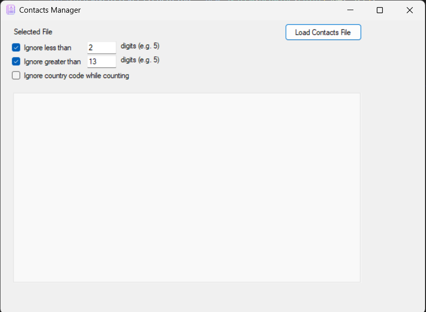
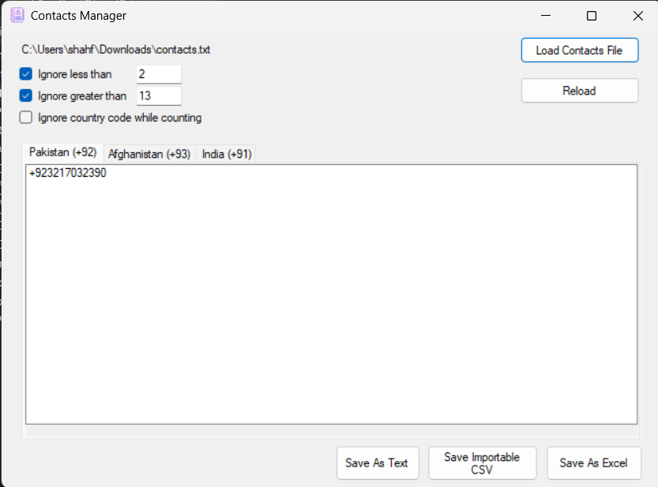
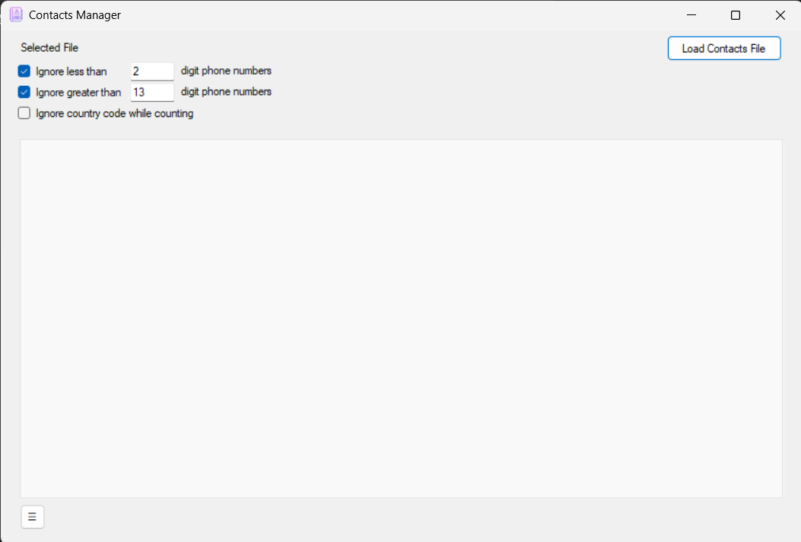
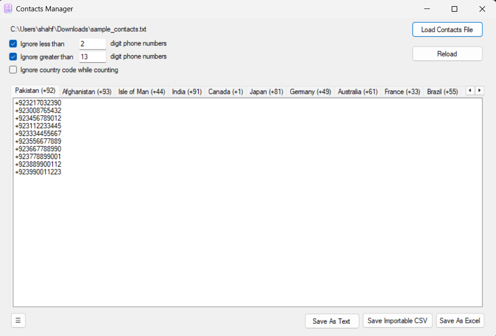
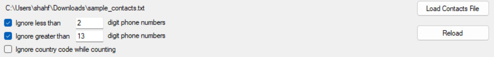
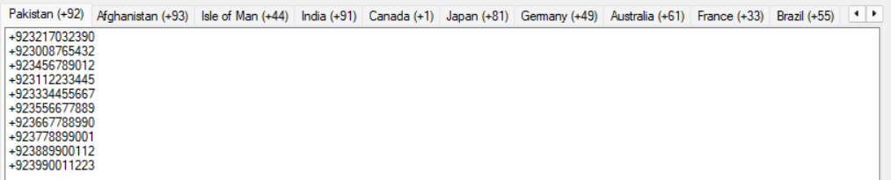

# Contacts Manager

A lightweight Windows Forms application for importing, organizing, and exporting phone contacts from text, CSV and Excel files. This repository includes the application source and an Inno Setup project that produces a Windows installer and a ZIP distribution.

Release artifacts (example)

- Installer EXE: `ContactsManager-Setup-1.0.0.0.exe`
- ZIP archive (contains the EXE): `ContactsManager-Setup-1.0.0.0.zip`

## Description

Contacts Manager extracts and normalizes phone numbers from common file formats, groups them by country code, and enables filtered exports to text, CSV, or Excel. It is designed for simple, offline processing on Windows.

## Key features

- Import contacts from `.txt`, `.csv`, and `.xlsx` files.
- Extract and normalize international phone numbers (expects leading `+` country codes).
- Group contacts by detected country code and display each group in a separate tab.
- Length-based filters:
  - Ignore numbers shorter than a value
  - Ignore numbers longer than a value
  - Option to exclude country code when counting digits
- Export options: Plain text, importable CSV, and Excel (EPPlus).
- Small WinForms UI with context menu and quick options (About, Update, Settings).

## Screenshots

Below are the application screenshots from the `assets/` folder. Add captions or replace filenames as needed.

## System requirements

- Windows 7 SP1 or later (Windows 10/11 recommended)
- .NET Framework 4.8
- ~100 MB free disk space
- (Build) Inno Setup required to build the installer

## How to install

From the release package:

1. Download `ContactsManager-Setup-1.0.0.0.zip` and extract it.
2. Run `ContactsManager-Setup-1.0.0.0.exe`. If prompted, allow the installer to run with administrative privileges.
3. Follow the installer prompts (choose install folder, create shortcut).
4. After installation, launch from Start Menu or desktop shortcut.

## How to use

1. Launch Contacts Manager.
2. Click "Load Contacts File" and select a `.txt`, `.csv`, or `.xlsx` file.
   - For best extraction results, include phone numbers with a leading `+` country code (e.g. `+923001234567`).
3. The app extracts numbers and creates tabs grouped by country code.
4. Use:
   - "Ignore less than" / "Ignore greater than" and the checkboxes to filter by length.
   - "Ignore country code while counting" to exclude the detected country code when measuring length.
5. Export a tab or all contacts using the provided Save buttons (Text, CSV, Excel).
6. Use the options menu for About, Update, and Settings.

## Developer notes

- Targets .NET Framework 4.8 (see `ContactsManager.csproj`).
- Excel support uses EPPlus.
- Installer script and Inno Setup config are in `installer/`.
- Keep `assets/` images and release artifacts inside `installer/Output/` or attach them to the release.

## Assets / Releases

Include these files in release assets:

- `ContactsManager-Setup-1.0.0.0.exe` — Installer executable
- `ContactsManager-Setup-1.0.0.0.zip` — ZIP containing the EXE
- `assets/` — screenshots referenced above

Consider publishing SHA256 checksums for the EXE and ZIP.

## Publishing checklist

- [ ] Confirm `installer/Output/ContactsManager-Setup-1.0.0.0.exe` exists and validate on a clean VM.
- [ ] Add real screenshots to `assets/` and update paths above.
- [ ] Tag the release (e.g. `v1.0.0`) and upload EXE/ZIP as release assets.
- [ ] Optionally include SHA256 checksums in release notes.

## Credits

- Author: Shah Faisal (ShahFaisalGfG)
- EPPlus (Excel export)
- Other libraries and helpers used in the project

## License

Add a `LICENSE` file at the repository root before publishing and reference it here.

## Contact / Support

Open an issue on the repository or contact the author via the GitHub profile: [ShahFaisalGfG](https://github.com/ShahFaisalGfG)
